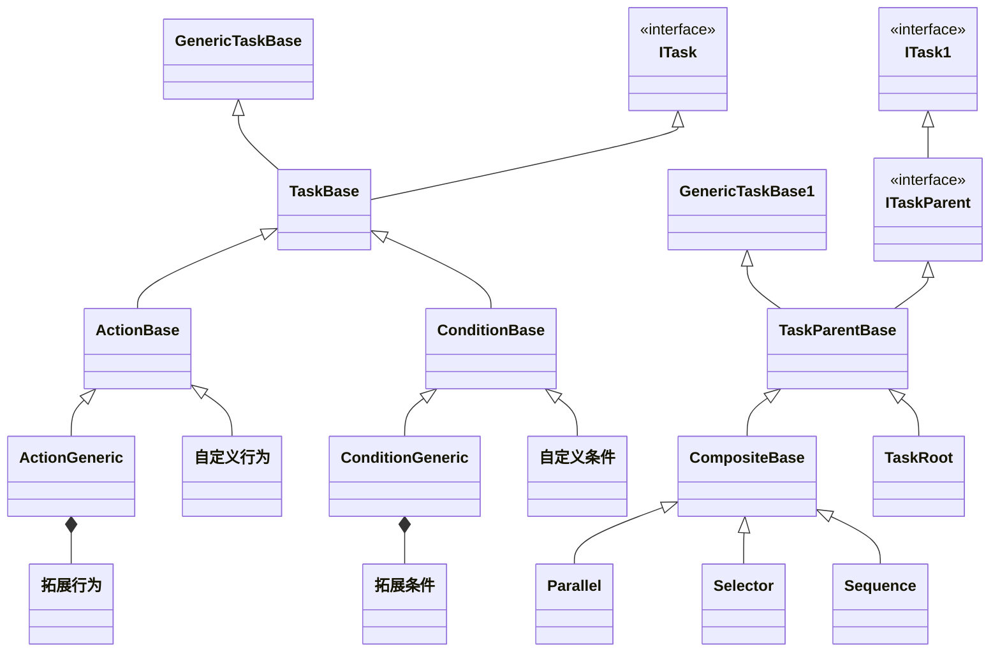
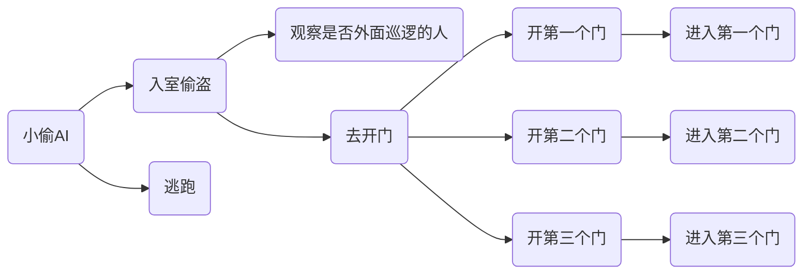

## Behavior Tree的介绍

之前实现过一个行为树，最近深入看了一下别人写的行为树框架。记下来。

[fluid-behavior-tree](https://github.com/ashblue/fluid-behavior-tree) 非常轻量级，而且好扩展的行为树。代码非常精简好读。

[NPBehave](https://github.com/meniku/NPBehave) 另外一种行为的实现，它相对于传统的行为树有很多优点，比如它有`blackboard`对象，所有的condition节点都不主动Update，而是监听一个`blackboard`上的变量。比如我们有个`InRange`的对象变量，意思是玩家是否在怪物的攻击范围之内。这个时候可以新建一个`BlackboardCondition`节点，来监听这个变量的改动。当变量修改的时候， 才会去执行`BlackboardCondition`。这个对于怪物行为的编写就很直观了，我们只需要监听这些变量，来触发行为。

`fluid-behavior-tree`的类关系图如下。都是继承`ITask`跟`GenericTaskBase`,  Task的一些方法定义在`ITask`中，而`GenericTaskBase`主要负责`Update`的基础实现（主要未了实现编辑器的功能，当Task被调用的时候，`GenericTaskBase`的Update就会被调用，从而实现可视化调试）。

其中 `ActionBase`跟`ConditionBase`分别未行为跟条件的基类。`ActionGeneric`和`ConditionGeneric`对扩展非常友好，你可以创建已给这个对象，然后赋给它update，Start，Init, Exit方法。

还有一些继承自`IparentTask`的容器类：

`Parallel`:顺序遍历每个一个节点，遇到`Continue`的时候还是往下执行。全部执行完，如果有`Failed`节点，返回`Failed`,  有`Continue`返回`Continue`, 全部成功返回`Success`。比如一个小偷的AI， 这个时候要边开门，一边看观察是否有人看到。如果被人看到，停止所有行动，跑。

`Selector` 顺序遍历节点，遇到`Continue`的时候， 停止遍历返回`Continue`,  执行到第一个success对象返回success，执行完都是`Failed`的时候，返回`Failed`, 否者返回`Continue`, 比如：一个小偷的AI，有3扇门，一个一个打开，看看哪个可以打开。

`Sequence` 顺序遍历每个节点， 遇到`Continue`的时候， 停止遍历返回`Continue`,  执行到第一个failed对象的时候返回failed，全部执行完都是success返回success， 否者返回Continue，比如， 一个小偷的AI，先执行开门，再执行进入。如果开门失败，就无法进入。

（注：这些`ParentTask`在返回值不是`Continue`的时候就调用`Reset`， 调用完`Reset`下次再进入的时候就会重新遍历， 否者会保留上次执行状态）

整合上面几个节点写一个例子：

一个小偷的AI：准备去偷东西，有三户人家，一个一个开，开起来了就进去。同时得小心有没有被巡逻的人发现，发现了就跑。

`入室偷盗`跟`逃跑`是`Selector`

`去开门`跟`观察是否有人`是`Parallel`

`开第一个门`， `开第二个门`， `开第三个门`是`Selector`

`开第一个门`跟`进入第一个门`是`Sequeue`

装饰器：

