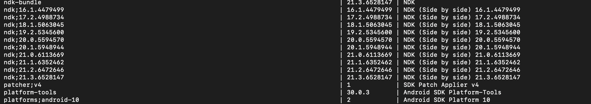

# 通过commandline来安装安卓的sdk跟ndk

## 准备工作
从[安卓开发者网址](https://developer.android.com/studio/index.html)下载Command line tools。下载下来之后把它解压出来。新建一个目录android_sdk_command_line，把解压出来的文件夹重命名为cmdline-tools，放到android_sdk_command_line中。

## 开始下载
我们可以使用命令来查看当前有哪些资源可以下载
`./tools/bin/sdkmanager --list`

我们选择自己需要的版本下载
`./tools/bin/sdkmanager  "platforms;android-33" "build-tools;33.0.0" "ndk;25.1.8937393"`

等待下载完成。

