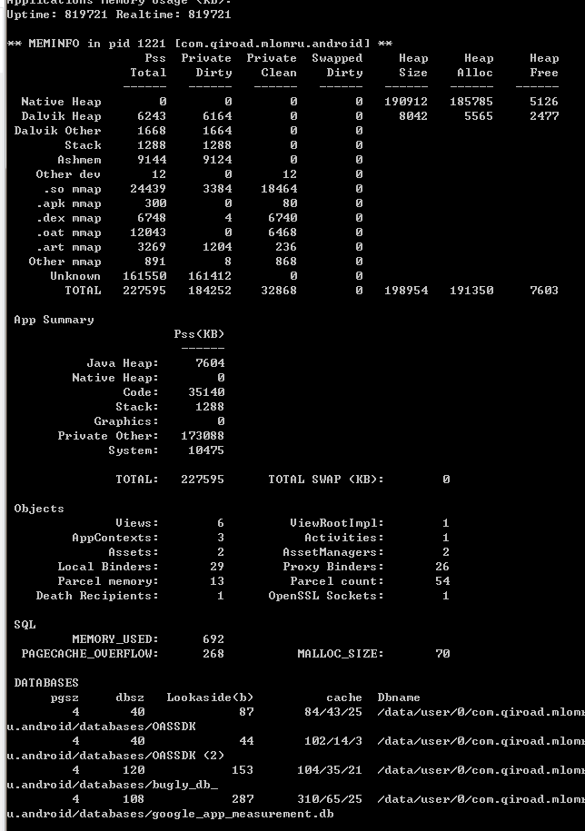

# 安卓内存快照

`adb shell dumpsys meminfo com.the7road.wartune2018.master`

`Pss` Proportional Set Size 按比例分配共享库的物理内存。
`Dalvik Heap` Java上分配的内存
`Native Heap` C++上分配的内存
`mmap` 镜像映射， `so mmap` 是so文件的映射，`.dex map`是java文件的映射， `.art mmap`是资源文件的映射
`gfx dev` 显卡里面的大小，差不多跟unity的gfx大小一样。

## 总览
`Java Heap`：java的内存
`Native Heap`：c++的内存
`Code` ： 被载入的代码内存
`Graphic`： 显存
`Private Other`： ???
`System`：???