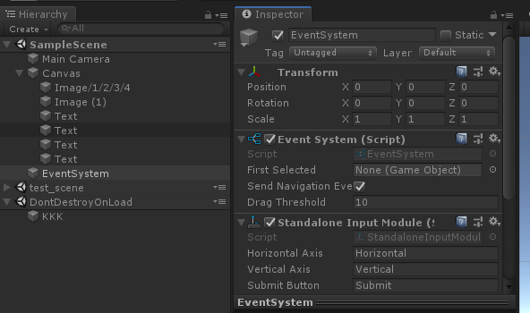
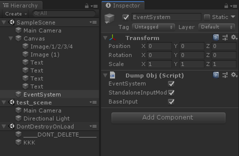
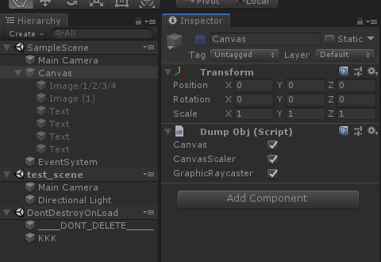
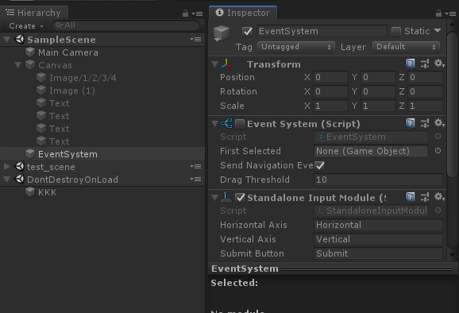

## Remote Opterator(Unity远程对象控制)
[demo](https://github.com/comedyy/RemoteOperatorTool)
## 需求
在设备中连接profiler中，看到在特定的角度有很大的渲染消耗，主要消耗在GPU上，目测应该是重绘太多或者是shader太复杂了，需要找到是哪个物件导致的渲染消耗。

有个想法出现，就是如果我们可以通过电脑上的Unity来控制设备上的游戏的显示和隐藏，那么我们就可以很快找到有渲染问题的物件。

## 实现原理
在电脑开设一个专门的unity项目，接受来自手机上的游戏发来的场景的信息，在电脑上构建出一模一样的Hierarchy，这样就可以通过操作电脑上的节点，来控制手机上的节点显示隐藏。

### 网络层
电脑开辟一个tcp端口，手机在需要调试的时候连接到电脑的端口实现数据通信。

### 协议
```
public class Node // 每个transform都抽象成一个Node对象，同时component也是一个Node对象
{
    public string name;
    public int child_index_of_parent;
    public bool active;
    public List<Node> list;
    public bool is_component;
}

public class Msg // 协议
{
    public short msg_type; // 协议号
    public List<Node> list; // 场景列表
}

```

## 细节
1. 同步设备上的信息给电脑
遍历所有的场景，生成数据塞到 Msg对象里面，发给电脑端。电脑端协议协议，在电脑上依次创建这些节点。



2. 通过电脑上的操作到设备
电脑端关闭打开节点，直接影响到设备上的显示跟隐藏。



