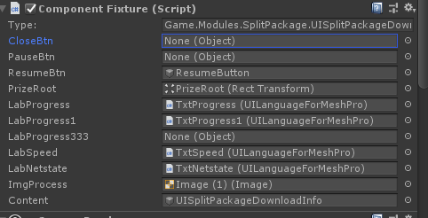

## ComponetFixture



### 用处
为了应对ui的更新，在xlua的框架下，我们需要有一个方式可以在uiprefab的inspect面板上显示当前ui程序用到的对象（image，text等）。
最普通的做法是直接新建一个Monobehavior，同时暴露给inspect。但是这个做法无法做到热更新。
鲁大师做了一个componentfixture可以做到既可以在uiprefab的inspect面板上显示对象，又可以实现热更新。

### 实现
使用一个通用的脚本Componetfixture，配合一个Editor，从ui控制器中拿取ui控件的类型跟名字，把它绘制到inspect面板上。
用户通过拖拽控件到inspect面板来实现引用关系的对应，同时序列化到prefab中。
在ui加载的时候，把componetfixture中的控件传递给ui控制脚本就可以了。

#### 序列化到Prefab
componetfixure中存储了几个数组，
```
[Serializable]
private struct ArrayInfo
{
    public int Next;
    public int Count;
}

[SerializeField]private string[] _field_names;                // 存放字段名字
[SerializeField]private Object[] _field_values;               // 存放Unity对象，包括在数组中的对象，数量不一定跟_filed_names一样
[SerializeField]private ArrayInfo[] _field_arrays;               // 存放数组信息
[SerializeField]private bool[] _field_references;           // 存放_filed_values的当前位置是否存放数据（为了显示Missing等信息）
```
具体序列化规则：
_field_names存放着所有的ui控制器中的变量的名字。
_filed_values存放所有的控件引用
_filed_arrays存放所有的数组信息（Next代表数组的第一个元素在_field_values中的索引，Count代表数组的元素）
_field_references代表当前位置是否被赋值过（用来显示是否是missing状态）

至于为啥用这个存储，有一个问题是unity无法序列化多维数组，所以数组必须要使用这个方式来序列化。


1.从ui控制脚本中获取控件的变量名跟数据类型。
从lua获取对象，是直接加载lua脚本，并且通过调用lua脚本的方法返回对应的ui控件信息,然后解析出来。
```
function UISplitPackageDownloadInfo.GetFieldsInfo()
	local fields = {
		"CloseBtn|UnityEngine.GameObject|false",
		"PauseBtn|UnityEngine.GameObject|false",
		"ResumeBtn|UnityEngine.GameObject|false",
		"_img_process|UnityEngine.UI.Image|true",
	}
	return connect(fields, Cs2Lua.Wartune.UI.UIBase.GetFieldsInfo())
end
```

2.对比当前序列化的数据，对当前的序列化数据进行兼容。
* 新加字段就往序列化数据里面添加一个数据。
* 删除了字段就删除掉序列化中的一个对象
* 如果改类型了，需要对比数据是否可以兼容


2.绘制到inspect面板上
直接遍历当前的lua里面的控件的key，然后用componentfixture中取数据填充。
```
EditorGUI.ObjectField(position, property, value_type, label); // 具体的做法比这个复杂
```

#### 传递给UI控制器
调用LoadFixture方法来进行传递
我们加载完ui之后，需要把componetfixture中的ui控件信息传给ui控制器
```
G_ComponentFixtureLoader.LoadFixture(script_obj, obj:GetComponent(typeof(G_ComponentFixture)));
```
这样，componentfixture就可以往lua脚本里面直接塞入 keyvalue形式的ui控件。

同时因为它支持把Componentfixture作为控件传入，所以塞入lua脚本的之前，需要把它子componentfixture构造完成。

### 实现细节
如何把在inspector上绘制出控件
需要用到 SerializedObject 跟 SerializedProperty。
使用他们有几个好处：
1. 自动的dirty检测机制，只要是使用Unityapi对SerializedProperty进行操作，在OnInspectorGUI()函数的最后，你使用SerializedObject.AppliyModification（）的时候，它会自动把修改的信息保存到硬盘。
2. 完整的UNDO兼容性。只要使用SerializedProperty，那么我们就可以使用`ctrl-z` `ctrl-y`来对操作进行undo跟redo。

不过他们也有几个比较不好的地方：
1. 使用他们来操作数据结构比较复杂。比如一个List对象，它仅仅提供了增删改查功能，对应的List对象有一堆的辅助功能。
2. 序列化对象有时候为了各种原因（unity序列化支持程度，节省空间等），会序列化成比较抽象的形式（比如componentfixture），那么它就很难使用SerializedProperty进行操作。因为当前我们要向序列化对象插入一个新的控件，我们得同时操作4个SerializedProperty。

列表的实现：
使用unity的内部list控件ReorderableList来实现。 它需要传入一个IList对象。来绘制列表，可以实现增，删，调整顺序的功能。基础用法比较简单：
```
using UnityEditorInternal;
_init_talk = new ReorderableList(list, type, true, true, true, true)
{
    drawHeaderCallback = (rect) =>
    {
        EditorGUI.LabelField(rect, title);
    },
    drawElementCallback = (Rect rect, int index, bool isActive, bool isFocused) =>
    {
        Object pre = list[index] as Object;
        list[index] = EditorGUI.ObjectField(rect, (Object)list[index], type, true);
        if (pre != (Object)list[index])
        {
            _dirty = true;
        }
    }
};
```

#### 旧的实现（高效率，低可读性）
大师实现了一种方式，直接使用SerializedProperty来操作原始序列化对象来完成Inspect界面的绘制，因此可能会有点不直观。
同时为了兼容ReorderableList，构建一个新的IList对象，来兼容ReorderableList的规范。

#### 简化版本实现（低效率，高可读性）
为了提高可读性，在SerializedProperty跟序列化对象中间插入了一个中间对象。
```
public List<FiledData> ListFiledInfo { get; } = new List<FiledData>();
public class FiledData
{
    public string filed_name;
    public List<Object> arr;
    public Object obj;
}
.....
    public override void OnInspectorGUI()
    {
        serializedObject.Update();
        _target_object.OnAfterDeserialize();  // 从序列化对象读取到临时对象中
        InputFileName(); // 绘制文件名
        GetFieldList();   // 获取文件对应的控件字段
        UpdateValidate(); // 更新序列化对象中的控件
        EditorGUI.BeginChangeCheck(); // 开始检测是否修改
        ... // 绘制控件

        if(EditorGUI.EndChangeCheck())
        {
          OnBeforeSerialize();                // 保存到序列化对象中
          serializedObject.ApplyModifiedProperties(); // 保存修改
        }
    }

```
#### 延伸 unity的UNDO
Unity的undo跟redo都是基于序列化对象来做的，使用SerializedObject.ApplyModification()的时候，如果有修改的情况，自动保存一次undo节点。