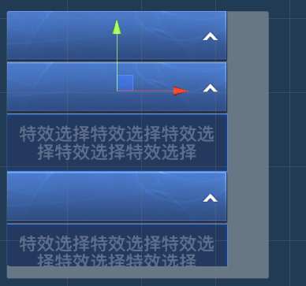
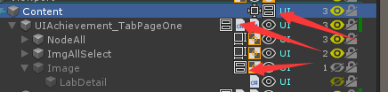

# UGUI Layout

为了实现一个特殊的功能，所以去深入的看了一下UGUI的Layout的源码。需求如下：

> 弄一个滑动窗口，里面有一堆的子对象，每个子对象点开之后会出现子对象的内容，内容有字符串，而字符串又在背景板上，这个背景板需要根据字符串的多少来动态调整高度。（其实就是跟聊天气泡差不多）

这里会用到 `VerticalLayoutGroup`，它有几个参数可以使用
1. `Padding` 控制子节点到自己的边缘的间隔
2. `Spacing` 控制子节点之间的距离
3. `Child Alignment` 控制子节点的锚点
4. `Child Controls Size` 控制子节点的大小
5. `Child Force Expand` 控制子节点在自己的空间内是否填充排布

这里主要关注一个参数 `Child Controls Size`，这个参数可以让 `VerticalLayoutGroup`在一个轴的方向上控制一个子节点的大小。
而这个子节点的大小是怎么控制的呢？

- `minHeight` 用来控制这个对象的最小高度，一般情况如果这个值比`preferredHeight`小，那么`preferredHeight`就等于这个值。
- `preferredHeight` 用来表示控件的高度
- `flexibleHeight` ？？？

通过查看源码我们知道，对象的这些高度值是从对象上的组件上获取的，而这些组件都是实现了 `ILayoutElement` 接口，具体有
`Image`, `Text`, `LayougGroup`, `LayoutElement`, `ScrollRect`, `InputField`。这些组件参与控制了对象的高度。

`Text` 的 `preferredHeight` 来自它的文本的实际高度
`Image` 的 `preferredHeight` 来自它的Sprite的高度

其中比较重要的是 `LayougGroup` 这个对象是可以嵌套使用的，原本`LayougGroup`只能控制它的子节点，而如果嵌套使用的话，它可以控制所有的子孙节点。

> 第一层layout实现排序跟控制子节点的高度。
> 第二层layout控制文字背景的高度
> 第三层layout控制文字的高度
> 这样，当文字dirty的时候，会setlayout dirty，进而让所有父节点的ILayoutGroup变dirty。
> 在重新布局的时候，先会从第一层layoutgroup开始 从叶子节点开始重新查找子节点信息，并计算节点大小，totalMin， totalPreferred, totalFlexible.
> 最后从根LayoutGroup开始，调整自己的位置（先计算ContentSizeFilter，再LayoutGroup），然后调整子节点的位置。
> 最后达到动态布局的效果。

这样我们使用`LayougGroup`的嵌套使用，并且每个`LayougGroup`都勾选 `Child Controls Size` 来实现当前需求。

同时，我们在根节点的LayoutGroup上添加ContentSizeFilter之后，就可以控制父节点的大小，而直接点因为添加了LayoutGroup，是无法添加ContentSizeFilter的，因为他们会相互冲突。
