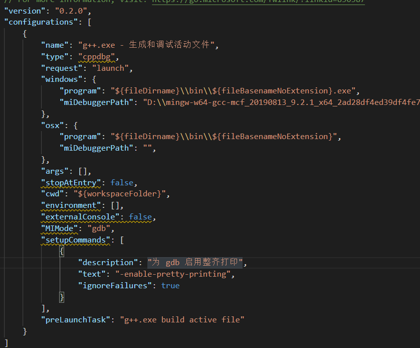

# vscode c++环境搭建

## [mingw](./mingw.md)
windows下的g++编译环境。

## vscode 添加build的task
`Terminal->Configure Default Build Task` 可以创建一个新的默认的编译任务，生成在.vscode/tasks.json。是一个json文件，包含编译所需的所有信息。
- `label` 当前任务的名字
- `command` g++的路径
- `args` 编译参数数组，包含编译所需的参数。
- `options` 下面有一个 `cwd`, 当前的目录？
- `windows` `osx` `linux` 可以用这些标签包含 command，args等通用标签，标明各个平台上的不同参数。
这样按下 `ctrl + shift + b` 就可以开始编译了。

## vscode 添加调试器
`Run->Add Configuration` 可以添加一个调试器，生成文件.vscode/launch.json，在`Run->Start Debuging` 的时候调用。

- `request` 填为`launch` 标明是为了启动一个应用程序
- `miDebuggerPath` 调试器的路径
- `program` 填入应用程序的路径
- `args` 命令行参数
- `preLaunchTask` 启动之前需要做的任务，一般填 `build task` 的 `label`
- `windows` `osx` `linux` 可以用这些标签包含 `command`，`args` 等通用标签，标明各个平台上的不同参数。
- console  internalConsole:默认无控制台，integratedTerminal：内部控制台，externalTerminal：外部控制台

